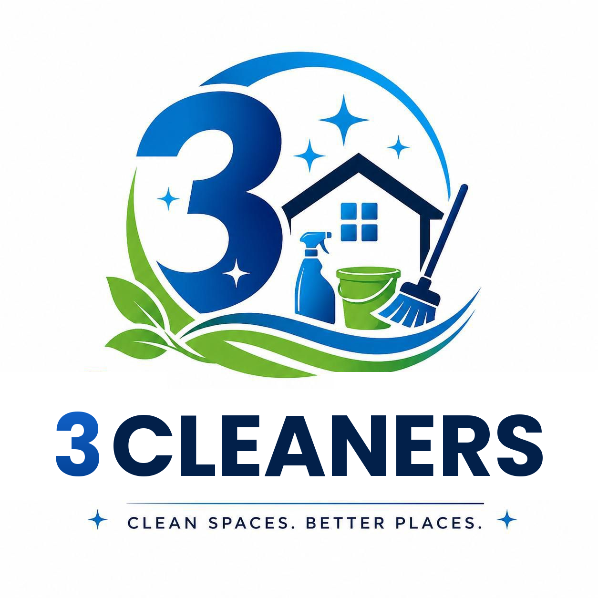

# 3 Cleaners — Website

**Tagline:** Clean Spaces. Better Places.

A responsive, single-page marketing website for a professional cleaning service. Built with Bootstrap 5.3 and no build tools — just open `index.html` in a browser.

---

## Quick Start

1. Clone or download this folder.
2. Open `index.html` in any modern browser.
3. That's it — no npm, no build step.

---

## Project Structure

```
3cleanerv2/
├── index.html          ← entire site (HTML + CSS + JS in one file)
├── assets/
│   └── 3Cleaners_logo.png   ← drop your logo here (optional)
├── README.md
└── CLAUDE.md
```

All CSS is in a `<style>` block inside `index.html`. Bootstrap 5.3, Bootstrap Icons 1.11, and the Poppins Google Font all load from CDN.

---

## Page Sections (top → bottom)

| # | Section ID | Purpose |
|---|-----------|---------|
| 1 | `#home` | Hero — headline, tagline, two CTAs |
| 2 | `#about` | Who we are + 3 trust-building features |
| 3 | `#services` | 6 service cards (Residential, Office, Deep, Move In/Out, Window, Eco) |
| 4 | `#pricing` | 3 pricing tiers — Basic ($89), Standard ($149), Premium ($229) |
| 5 | `#contact` | Info cards (phone/email/address/hours) + contact form |

---

## Brand Colors

Colors were extracted directly from `assets/3Cleaners_logo.png` using Pillow color quantization.

| Token | Hex | Used for |
|-------|-----|---------|
| `--primary-blue` | `#016BBD` | Buttons, card accents, hero icon |
| `--dark-navy` | `#02204A` | Headings, navbar brand, footer |
| `--accent-green` | `#7CB750` | Eco highlights, check icons, "Most Popular" badge |
| `--light-bg` | `#F0F7FF` | Alternating section backgrounds |
| `--text-dark` | `#02204A` | Body copy |
| `--text-muted` | `#5A6E8A` | Subtitles, captions |

All colors are defined as CSS custom properties in `:root` — change them in one place to retheme the whole site.

---

## Common Customisations

### Swap in the real logo

Replace the `<a class="navbar-brand">` block in the Navbar with:

```html
<a class="navbar-brand" href="#home">
  
</a>
```

### Update contact details

Search `index.html` for the placeholder values:

- `+1 (555) 123-4567` → real phone number
- `hello@3cleaners.com` → real email
- `123 Clean Street, Your City` → real address
- `Mon–Sat, 8 AM – 6 PM` → real hours

### Change prices

Find `$89`, `$149`, `$229` in the Pricing section and update the figures and feature bullet lists.

### Wire up the contact form

The `<form>` in the Contact section has no `action` yet. Three easy options:

- **Formspree** — `<form action="https://formspree.io/f/YOUR_ID" method="POST">`
- **Getform** — `<form action="https://getform.io/f/YOUR_ID" method="POST">`
- **Custom backend** — point `action` at your own API endpoint

### Add / remove a service card

Duplicate any `<div class="col-md-6 col-lg-4">` block inside `#services`. Blue cards use `class="service-card"`, green cards use `class="service-card green"`. Pick an icon from [Bootstrap Icons](https://icons.getbootstrap.com/).

### Add a new pricing tier

Duplicate a `<div class="col-md-6 col-lg-4">` block inside `#pricing`. Add `class="featured"` to the card + a `<span class="tag">` for a badge.

---

## Responsive Breakpoints

| Viewport | Layout |
|---------|--------|
| < 768 px (mobile) | 1-column, hamburger nav, centered hero, pricing cards equal size |
| 768–991 px (tablet) | 2-column services & pricing |
| ≥ 992 px (desktop) | 3-column services & pricing, Standard card scaled up |

---

## Dependencies (CDN — no install)

| Library | Version | Purpose |
|--------|---------|---------|
| Bootstrap | 5.3.2 | Grid, components, utilities |
| Bootstrap Icons | 1.11.1 | All icons site-wide |
| Poppins (Google Fonts) | — | Typeface |

---

## JavaScript Features

- **Smooth scroll** — all `<a href="#...">` links animate to their target.
- **Mobile menu auto-close** — hamburger menu collapses after a nav link is tapped.
- **Active nav highlight** — IntersectionObserver marks the current section's nav link as active while scrolling.
